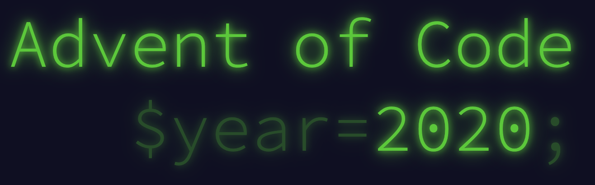

# Advent of Code 2020

# What is Advent of Code?
> Advent of Code is an Advent calendar of small programming puzzles for a variety of skill sets and skill levels that can be solved in any programming language you like **yes, including JavaScript and Python!!!**
> Every day for 25 days this month you have small programming challenges that you need to solve to complete the "tree". Each day, the questions get a little bit harder to really push you to learn and improve your programming skills.

I started this challenge by [code challenge](https://github.com/zero-to-mastery/coding_challenge-33/blob/main/README.md) proposed by [zero to mastery](https://zerotomastery.io/)

[Advent of code 2020 edition](https://adventofcode.com/)
